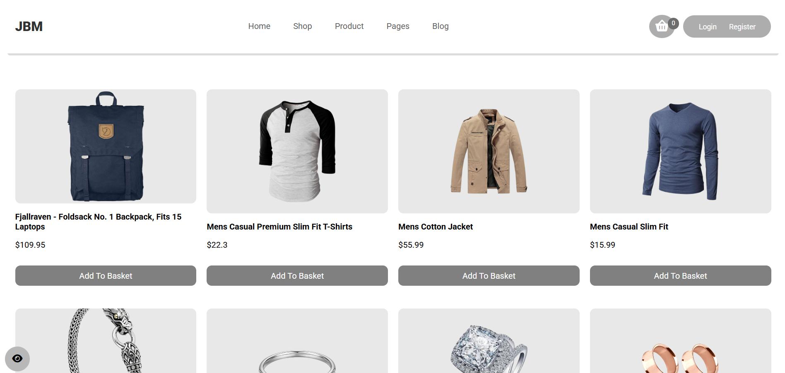

````md
# 🛍️ JBM Shop Demo
````
یک پروژه‌ی فروشگاه اینترنتی زیبا و کاربردی ساخته‌شده با **HTML، CSS و JavaScript خالص**  
این پروژه توسط **Mohammad JBM** طراحی و توسعه داده شده و از یک API واقعی برای نمایش محصولات استفاده می‌کند.

---

## ✨ ویژگی‌ها

✅ نمایش محصولات واقعی از [FakeStoreAPI](https://fakestoreapi.com)  
✅ افزودن محصول به سبد خرید  
✅ افزایش و کاهش تعداد محصول  
✅ حذف محصول از سبد خرید  
✅ محاسبه خودکار مبلغ نهایی + مالیات ۹٪  
✅ تولید و اعتبارسنجی کد تخفیف تصادفی  
✅ طراحی **دسترسی‌پذیر (Accessibility Friendly)** شامل:  
- افزایش / کاهش اندازه فونت  
- کنترل کنتراست رنگی  
- سازگار با افراد کم‌بینا  

---

## 🧠 تکنولوژی‌های استفاده‌شده

- **HTML5**
- **CSS3**
- **Vanilla JavaScript (ES6)**
- **FakeStoreAPI** برای دریافت داده‌های واقعی

---

## 💻 نحوه اجرا

1️⃣ پروژه را Clone کنید:
```bash
git clone https://github.com/MohammadJBM/jbm-shop-demo.git
````

2️⃣ وارد پوشه شوید:

```bash
cd jbm-shop-demo
```

3️⃣ فایل `index.html` را در مرورگر باز کنید و لذت ببرید 😄

---

## 📸 پیش‌نمایش (Preview)



---

## 🧩 ساختار فایل‌ها

```
index.html         → صفحه اصلی محصولات  
style.css          → استایل اصلی  
script.js          → کدهای جاوااسکریپت  
/img/           → تصاویر و آیکون‌ها  
```

---

## 🧱 هدف پروژه

این پروژه برای یادگیری و تمرین مفاهیم کاربردی جاوااسکریپت طراحی شده است
و به‌عنوان یک **نمونه‌کار واقعی (Portfolio Project)** برای نمایش مهارت‌های Mohammad JBM در طراحی رابط کاربری و منطق فرانت‌اند ساخته شده است.

---

## 🧑‍💻 توسعه‌دهنده

**Mohammad JBM**
🎥 [YouTube - Mohammad JBM](https://youtube.com/@Mohammad_JBM)
🐙 [GitHub](https://github.com/Mohammad-JBM)

---

## 📄 مجوز (MIT License)

پروژه آزاد است و برای استفاده‌ی آموزشی و شخصی در دسترس است.
استفاده، ویرایش و اشتراک آن بدون محدودیت مجاز می‌باشد.

---

⭐ اگر این پروژه برایتان جالب بود، لطفاً آن را Star کنید تا حمایت کنید ❤️


```txt
MIT License

Copyright (c) 2025 Mohammad JBM

Permission is hereby granted, free of charge, to any person obtaining a copy
of this software and associated documentation files (the “Software”), to deal
in the Software without restriction, including without limitation the rights
to use, copy, modify, merge, publish, distribute, sublicense, and/or sell
copies of the Software, and to permit persons to whom the Software is
furnished to do so, subject to the following conditions:

THE SOFTWARE IS PROVIDED “AS IS”, WITHOUT WARRANTY OF ANY KIND.
````